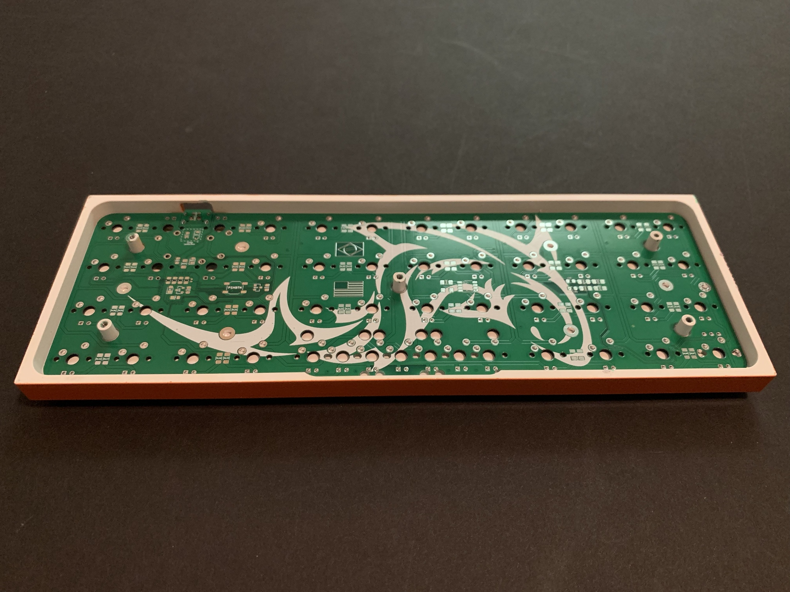
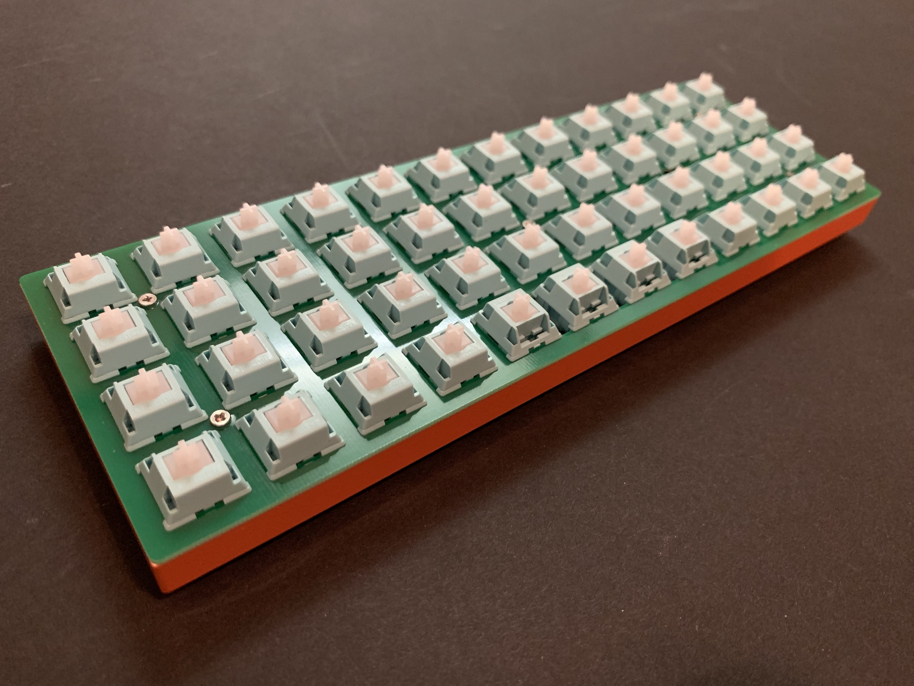

# Acheron Aχξρων 40-SM-O-MX-TH-WI (Codename "SharkPCB")

   

## Table of Contents <!-- {{{1 -->

  * [Project overview](#project-overview)
  * [Frequently Asked Questions (FAQ)](#faq)
  * [Board preview](#board-preview-version-31)
  * [The custom case](#the-custom-case)
  * [Changelog](#changelog-and-version-control)
  * [The PCB prototypes](#the-pcb-prototypes)
  * [Bill of Materials](#bill-of-Materials)
  * [Acknowledgements](#Acknowledgements)
  * [License](#license)

## Project overview <!-- {{{1 -->

The SharkPCB is a freely available, open-source 40% keyboard Printed Circuit Board (PCB) supporting three layouts: full grid, 1x2U spacebar and 2x2U spacebar. All resources and software used to design this board are open-source and/or freely available.

Here's a list of the board's features:

- ARM Cortex M4-based STM32F303 processor;

- QMK firmware compatible;

- USBC type connector;

- RGB underglow through intelligent integrated controller WS2812B LEDs;

- Three layout support: full-grid (FG), 1 centered spacebar (1S) and double spacebar (2S);

- Rotary encoder support;

- Hardware reset through a push button and reset network;

- Overcurrent and overvoltage input protection through a fuse and schottky diode;

- Electrical Static Discharge (ESD) protection through a discharge net.

Additionally, plate gerber files are also available so that the user can order them made from the same manufacturer as the PCBs and out of the same material (FR4, a fiberglass enhanced resin laminate). This makes production cheaper and faster.

There are four plate designs available: one for each supported layout and a universal one that supports all three of them.

## FAQ <!-- {{{1 -->

 Is this design functional and tested? 
 <!-- {{{2 --!>

> Yes. Version 3.1 was prototyped and is proven to work.

<!-------------------------------------------------------------------->

 How can I obtain this PCB? Is there an IC or a GB thread? 
 <!-- {{{2 --!>

> There is an [IC thread](https://geekhack.org/index.php?topic=98934.0) on GeekHack, where many users have contributed to the design and given their thoughts. Any help or opinion is highly appreciated. There is also a [GB thread on Reddit](https://www.reddit.com/r/mechmarket/comments/b0sn8f/gb_shark_pcb_a_new_40_ortho_kit/) and a [GB thread on Geekhack](https://geekhack.org/index.php?topic=99753). For updated information please always check the GeekHack IC thread or this project's page.

> Additionally, you can order the PCBs from a manufacturer like JLCPCB (for instructions see [this link](https://www.youtube.com/watch?v=0u9Io4pw-b0) starting at 1:02:00) and the components from LCSC (how to do that in [this link](https://www.youtube.com/watch?v=eFgOC5_1VYU&t=176s)) and build the board. This takes some expertise in electronics though, as the SMD parts require knowledge and specialized tools and supplies. This is why me and Steve hold Group Buys. Also manufacturers generally have a Minimum Order Quantity of 5 or 10 PCBs. Feel free to arranje a group buy with your circle of friends.

 Where are you planning to distribute this board? 
 <!-- {{{2 --!>

> Steve from WoodCables is handling the GB in the US and I am handling it in Brazil. The UE is not out of the question, and I have some connections there should the european community show interest.

 How much will this board cost? 
 <!-- {{{2 --!>

> We are aiming at a US$40,00 mark. The prototypes show that this is likely to be achieved.

 Will you (or Steve) profit from this project? 
 <!-- {{{2 --!>

> I won't profit from it myself, although I retain a little portion of the gains to fund further projects, that is, to maintain prototyping, components and overall design costs. A famous brazilian writer, Millôr Fernandes, once said: "never trust an idealist that profits from his ideals".

> Steve, on the other hand, has my permission to use the design commercially, so I'm not entitled to tell him if he should profit and how much, as he runs his own shop. Nevertheless we keep in close contact and it is, obviously, in the best interest of both us and the community that the prices are kept affordable and as low as possible.

 Who is funding this project? 
 <!-- {{{2 --!>

> I and Steve are -- although mostly him as parts and equipment availability in Brazil is limited. Also anyone that obtains this board either through one of the Group Buys or throw Wood Cables (Steve's shop) will be supporting the project as all gains from the sales and GBs are reserved to be used only with the project.

 Can anyone contribute to this project? 
 <!-- {{{2 --!>

> Anyone is welcome to contribute, be it through feature requests, opinions or criticisms. This can be done through the GeekHack posts, issues and questions on GitHub or even through my Discord (#Gondolindrim#9738). If you want to actively contribute to the design, feel free to contact me and we'd be glad to have you. 

 Why open-source? 
 <!-- {{{2 --!>

> As I don't intend to profit from this, there is no reason to keep the design closed. I also have the opportunity to contribute to the open-source way of thinking: many heads are better than one. Following these steps I use only open-source stuff to design the keyboards: the ECAD design is made with KiCad, the renders and animations in Blender, the logo design in Inkscape. All these software are run on Arch Linux, which is a Linux distro heavily based on the OSS and KISS principles.

> By adopting free OSS tools any newbie makers can take a look and learn from these designs, that is, I also have an educational reason in mind. In this regard, I also have a transparency principle, that is, anyone in the community can contact me and ask questions about the project and the design decisions or the design process. Any maker can also check my designs and points its flaws.

> Second, there is also the KISS (Keep It Simple, Stupid!) principle in mind. Since this project is completely un-ambicious, I try to keep it as simple as possible, so that the design and community processes are fluid.

 And why publish the design under a share-alike non-commercial license? 
 <!-- {{{2 --!>

> The reason for the license is twofold: first, while I want the design to be open-source, that is, educational and freely available, I think it's not just that someone could just take it, make little adaptations (like changing the logos) and profitting from it when the idea of the project is to have the open-source ideas in mind. It's not about myself -- although of course I have some pride in my designs and like to have credit for them -- but about the project ideals.

> Second, I don't condemn the idea of commercializing my designs, I'd just like to know who is selling it so that I can have a good quality control.

 What resources and software do you use? 
 <!-- {{{2 --!>

> All the footprints and symbols are available wither on the KiCad libraries or my MX library, which contains footprints and symbols for some components not available on KiCad.

> The design, footprints and symbols are made through KiCad. The 3D models are obtained in sites where the content is free and widely available like 3D Content Central and GrabCad Community, and to edit them I use FreeCAD.

> The logos were designed in Inkscape. The base image was taken from [this page](https://www.vectorportal.com/StockVectors/Animals/SHARK-ILLUSTRATION/15844.aspx) (last access: 26 feb, 2019). Although stated in the Vector Portal site that the designs are freely available to be used in commercially, I tried to contact the uploader, who goes by the name of "Yohan Plantec" with no success.

> The renders and animations are made in Blender.

 How can I follow your design process and learn from this project? 
 <!-- {{{2 --!>

> I try to stream the design process when I can. I generally do it at tuesdays and thursdays at 3PM PST (8PM BRT). In the streams I answer general electronics questions, and show how the board is designed. I stream at my [Twitch channel](http://twitch.tv/gondolindrim_). The past streams can be seen in my Youtube channel.

## Board preview (version 3.1) <!-- {{{1 -->

 Front 

 Front 

## The custom cases <!-- {{{1 -->

The folder ./case has the .stp and .stl files for the custom cases being designed, one being a low-profile (switches are exposed) and another a high-profile. The cases are not ready and were not prototyped; also feedback from the community is still underway so we are still setting on some matters before releasing them.

The case was designed in Fusion360, which is not open-source but is freely available. I had a hard time with 3D modelling in Blender, specially because it was not designed to interact with CAD and parts manufacturing; for example, it does not output its files in the STEP format, which is a major problem since that is the standard file extension used in the industry.

Steve and I will soon make an IC post where users can input their feedback. In any case, anyone can contact me directly through Reddit or Discord.

If you want to fork or create a case based on this one, you can check the public links for the [low profile](https://myhub.autodesk360.com/ue2d0e419/g/shares/SH7f1edQT22b515c761e412cd5b215194de6?mode=embed&viewState=NoIgbgDAdAjCA0IDeAdEAXAngBwKZoC40ARXAZwEsBzAOzXjQEMyzd1C1cBOAMwgA4AbAGMARgFouuGF3EAWUaNlcATAGYJgiBB4B2ACb6YjflLQBfEAF0gA) and for the [high profile](https://myhub.autodesk360.com/ue2d0e419/g/shares/SH7f1edQT22b515c761e0bc166c9ba566c91?mode=embed&viewState=NoIgbgDAdAjCA0IDeAdEAXAngBwKZoC40ARXAZwEsBzAOzXjQEMyzd1C0AWAdgDNOYAJlzcAtBBgxeozhAi5RAIwDGANgDMoxpwCsMNZwAcjdb0NoAviAC6QA) cases. With these links you can download the project files like F3D, STL, STEP and so on.

## Changelog and version control <!-- {{{1 -->

<!-------------------------- 3.0.1 --------------------------------------{{{2>

 
 <b> 2019/01/12 (V3.0.1) </b>

 

 <h6> Started porting the version 2 from the ATMEGA32U4 processor to a more modern ARM Cortex M4 STM32F303CCT6 processor </h6>

<!-------------------------- 3.0.2 --------------------------------------{{{2>

 
 <b> 2019/01/13 (V3.0.2) </b>

 

 <h6> Added USBC connector </h6>

<!-------------------------- 3.0.3 --------------------------------------{{{2>

 
 <b> 2019/01/14 (V3.0.3) </b>

 

 <h6> Added RGB underglow with the WS2812B </h6>

<!-------------------------- 3.0.4 --------------------------------------{{{2>

 
 <b> 2019/01/15 (V3.0.4) </b>

 

 <h6> Changed the grid used from the standard 19.05mm to the 19mm used in the Planck </h6>

<!-------------------------- 3.0.5 --------------------------------------{{{2>

 
 <b> 2019/01/21 (V3.0.5) </b>

 

 <h6> Solved a problem with connector wiring and added a nice render to the README </h6>

<!-------------------------- 3.0.6 --------------------------------------{{{2>

 
 <b> 2019/01/26 (V3.0.6) </b>

 

 <h6> Changed components to SMD. </h6>

 <h6> Added Blender renders. </h6>

 <h6> Updated preview. </h6>

<!-------------------------- 3.0.7 --------------------------------------{{{2>

 
 <b> 2019/02/13 (V3.0.7) </b>

 

 <h6> Added US and BR flags to the design. </h6>

 <h6> Rounded corners to fit the Planck Low-Pro case (as suggestged by garbo from Geekhack) </h6>

 <h6> Adjusted 3D models of crystal and Push Button. </h6>

<!-------------------------- 3.1.0 --------------------------------------{{{2>

 
 <b> 2019/02/20 (V3.1.0) </b>

 

 <h6> Added rotary encoder support. </h6>

 <h6> *This is supposed to be the final version of the V3 series. It will be prototyped in the next weeks.* </h6>

<!-------------------------- 3.1.1 --------------------------------------{{{2>

 
 <b> 2019/02/27 (V3.1.1) </b>

 

 <h6> Fixed a little problem with the Edge Cuts. Somehow for a reason only God knows KiCad messed up the starting and finish point coordinates of the lines and arcs in this layer. This has now been fixed manually. Really small (less than 5 mil) modifications were made on the edges of the PCB. </h6>

<!-------------------------- 3.1.2 --------------------------------------{{{2>

 
 <b> 2019/03/12 (V3.1.2) </b>

 

 <h6> We incorporated some feedback we got from the IC and GB posts on GeekHack and Reddit. </h6>

 <h6> First a second position for the Rotary Encoder was added; some users noted that the previous position, bottom left, was where the arrow keys were located and as such this was an important position. So an extra possible position was added, the bottom right. The problem is that this position is where the CTRL key is located, and is also an important position. I deemed it was not worthy to add encoder positions on the top left or right corners, as those are the ESC and BKSPC keys, which are of utmost importance. So this means that it is up to the user where the rotary encoder goes: either bottom left or bottom right. Note that although both positions are offered, *the user must choose only one of them, that is, do not use two rotary encoder positions at the same time* as this will probably not work because both positions share the same microprocessor pins.</h6>

 <h6> Second, the reset push button was moved to match the reset hole in the back of Planck cases. I always thought that it was kind of wrong that in order to access the reset button the case should have a hole in it, which in my opinion kind of disrupted the case back look. To solve this I put the reset push button in the cross space between four neighboring keys, and a little hole in the plate, so that the user could access that button easily without needing a dedicated hole in the case. The problem with my design is that, by default, Planck cases have such dedicated hole and it is a nonsense to not use it as the majority of Planck users are used to it. So I moved the button to match the Planck hole. I'll maybe go with my design if I happen to make a custom case for the Shark. In the meantime, the default Planck position will do. </h6>

<!-------------------------- 3.1.3 --------------------------------------{{{2>

 
 <b> 2019/03/13 (V3.1.3) </b>

 

 <h6> The switch plate cutout was revamped to allow users to take the switch top while the switch is mounted on the plate. </h6>

 <h6> Hi-pro plates were added, as suggested by user sam278 from Geekhack.</h6>

 <h6> Added I2C communication pins, as suggested by user equalunique from Geekhack. The user can use the holes or solder a four-pin JST BM04B-ASRS-TF connector that is in the BOM. If the user does not want to buy the connector, he or she can use the THT pads right next to the connector pads. </h6>

<!-------------------------- 3.1.4 --------------------------------------{{{2>

 
 <b> 2019/03/16 (V3.1.4) </b>

 

 <h6> The I2C connector was changed to a common 4-pin header. </h6>

 <h6> Added extra header pins for the remaininn not used pins of the microcontroller. With these pins the user will be able to expand the keyboard by adding off-board devices. </h6>

<!-------------------------- 3.1.5 --------------------------------------{{{2>

 
 <b> 2019/03/19 (V3.1.5) </b>

 

 <h6> Some components, like the LDO and its network, as well as the reset network, was moved to the bottom layer to ensure no component would get in the way of the switches when mounting them. </h6>

<!-------------------------- 3.1.6 --------------------------------------{{{2>

 
 <b> 2019/03/21 (V3.1.6) </b>

 

 <h6> Capacitor CVBus1, which was a 1uF 0406, was changed to 1uF 0805 to match the other CVBus'es. </h6>

 <h6> The BOM had minor problems like components out of stock and incongruent information (e.g., 0805 resistors when they should be 1206). This has all been fixed and checked. Double checked. I dare you to find a problem. I double dare you, MFer. </h6>

<!-------------------------- 3.1.7 --------------------------------------{{{2>

 
 <b> 2019/04/10 (V3.1.7) </b>

 

 <h6> The plate files were adjusted to fit the custom case. </h6>

## The PCB prototypes <!-- {{{1 -->

See the pictures below.

The prototyped version was V3.1. The plates were ptotoyped with plain square slots, and work perfectly. 

 Front 

 Back 

 On a Planck lo-pro case 

 With mounted switches 

## Bill of Materials <!-- {{{1 -->

In the ./bom/ folder there is an .xlsx file that can be uploaded directly into the LCSC site. The file contains all LCSC part numbers, quantities and descriptions. 

If you don't want to order them from LCSC, the table below can be used.

| Description  | Value | Package | Quantity |
| ------------- | :-------------: | :-------------: | :-------------: |
| J1 | - | TYPE-C-31-M-12 USBC Connector | 1 |
| C1 and C2 | 22pF | 0805  | 2 |
| C7, C9, CRST1, CRST2 | 4.7nF | 0805| 4 | 
| (Poly)Fuse | 1.5A trip | 0805 | 1 | 
| R5 and R6 | 1MOhm | 1206 | 2 | 
| Q1 | AO4406AL | SOIC8 | 1 | 
| CSin1, CSout1, CVBus1-3, CA1, CB1 | 100nF | 0805 | 7 | 
| CVBus4 | 1uF | 0805 | 1 | 
| CVBus5 | 4.7uF | 0805 | 1 | 
| DF1 | RB060M-60TR Schottky Diode | SOD-123 | 1 | 
| QRST | BC846 NPN BJT | SOT-23 | 1 | 
| RCC | 5.1kOhm | 1206 | 1 | 
| RD+ and RD- | 22ROhm | 1206 | 2 | 
| RD+Up | 1.5kOhm | 1206 |  1 | 
| RPGate, RB1/2, RA1/2 | 10kOhm | 1206 | 5 | 
| RRST | 100kOhm|  1206	| 1 | 
| RSGate1 | 100 Ohm | 1206 | 1 | 
| SWRST1 |SMD Push Button | - | 1 | 
| U1 | STM32F303CCT6 | LQFP48 | 1 | 
| U2 | MCP1700-330 LDO | SOT23 | 1 | 
| Y1 | 8MHz 4 pin SMD Crystal | 5032 | 1 | 
| RGB | WS2812B | - | 8 | 
| RL1-RL48 | 360 Ohm | 1206 | 50 | 
| D1-48, DS1 and DRST | 1N4148W | SOD-123 | 52 |
| ROT1 | ALPS EC11Ex (see note 1) | - | 1 |

(1) Any EC11Ex rotary encoder should be fine, as the models differ only on shaft shape and size but their footprints are the same. In the render I used the ALPS EC11E 15244G1.

## To-do list <!-- {{{1 -->
- [x] Finish the porting to STM32 (as suggested by Walkerstop from GH)
- [x] Change the grid from 19.05mm (3/4΅) to 19mm as the Planck does (as suggested by garbo from GH)
- [x] Add RGB underglow support

- [x] Constructed photorrealistic renders of latest version. (v3.1)

- [x] Finish SMD design
- [x] Finished SMD plates (single spacebar, dual spacebar, full-grid and universal)
- [x] Prototyped SMD design

- [ ] Finish THT design
- [ ] Finish THT plates
- [ ] Prototype THT design

## Acknowledgements <!-- {{{1 -->

Although there is only me actively working on the project design, some acknowledgements are due:
  * Steve from [WoodCables](https://woodcables.com/). Steve was the proponent of this project and funded it with his own money. He will also take care of the distribution and Group Buys in the US.
  * Gustavo "UndecidedShark" Reinert. As denoted in the PCB, this board was named after him. I take special pride in this as I gave him his nickname.
  * Felipe "MrKeebs" Gonçalves and Raphael "ArcticFox" Hochheim. Dear friends and always up to help with my questions.
  * User [garbo](https://geekhack.org/index.php?action=profile;u=63207) from GeekHack, who helped immensely in this design by giving me hints and information, always opinating and giving feedback with christian patience. [Walkerstop](https://geekhack.org/index.php?action=profile;u=68625) also helped by recommendations like using the STM32 family of processors and a USBC connector.
  * User [u/ajp10304](https://www.reddit.com/user/ajp10304) from Reddit. Now this guy read the README and the documentation thoroughly and pointed inconsistencies and errors several times. He gave me good reasons to make a nice documentation and he helped me immensely by this;
  * [Jack Humbert](https://github.com/jackhumbert), from OLKB, and [ishtob](https://github.com/ishtob) from the QMK Discord Server. Jack was always very amicable and helpful; the 3D CAD files for the Planck Cases and plate came from the QMK parts Git repo. ishtob was always very accessible and helping with some design questions; in fact, some of the footprints and symbols used were based off of some of his own. In this regard many people in the Discord server helped with small hints (like yanfali, Upas and MechMerlin).

## License <!-- {{{1 -->

This project is licensed under the Creative Commons Non-Commercial Share-Alike 4.0 license, available in (https://creativecommons.org/licenses/by-nc-sa/4.0/).

This license allows you to copy and redistribute this project, as long as you give the author credit and have non-commercial purposes. If you have commercial purposes, please feel free to contact me through the channels I disclosed in this README file.

To know more about why I published the project under this license, please look at the [FAQ section](#faq).
