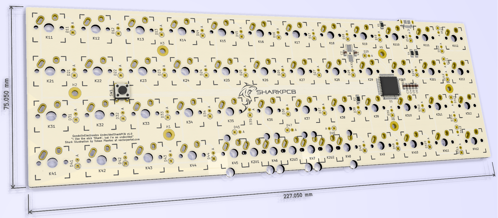
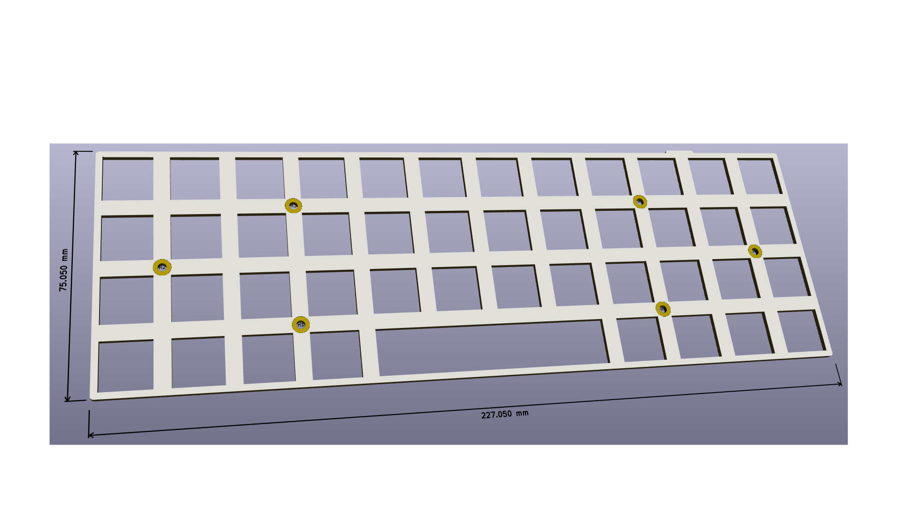

# SharkPCB project

This is a project to make a freely available, open-source 40% keyboard Printed Circuit Board (PCB). The board is compatible with Planck plates and cases and supports three layouts: full grid, 1x2U spacebar and 2x2U spacebar.

The gerber files also contain a plate file, from which a plate can be made of FR4 (the same material as the circuit board) in the same factory as the PCB itself.

# Board preview:

# Plate preview:

This project is licensed under the Creative Commons Non-Commercial Share-Alike 4.0 license, available in (https://creativecommons.org/licenses/by-nc-sa/4.0/).
